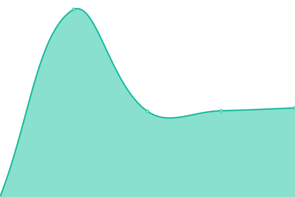

# [📈 Live Status](https://services.oca.ac.uk): <!--live status--> **🟩 All systems operational**

This repository contains the open-source uptime monitor and status page for [Paul Vincent](https://services.oca.ac.uk), powered by [Upptime](https://github.com/upptime/upptime).

With [Upptime](https://upptime.js.org), you can get your own unlimited and free uptime monitor and status page, powered entirely by a GitHub repository. We use [Issues](https://github.com/mrvinceo/ocaUptime/issues) as incident reports, [Actions](https://github.com/mrvinceo/ocaUptime/actions) as uptime monitors, and [Pages](https://services.oca.ac.uk) for the status page.

<!--start: status pages-->
<!-- This summary is generated by Upptime (https://github.com/upptime/upptime) -->
<!-- Do not edit this manually, your changes will be overwritten -->
<!-- prettier-ignore -->
| URL | Status | History | Response Time | Uptime |
| --- | ------ | ------- | ------------- | ------ |
|  [Google](https://www.google.com) | 🟩 Up | [google.yml](https://github.com/mrvinceo/ocaUptime/commits/HEAD/history/google.yml) | 

 126ms
     
 | 

<a href="https://services.oca.ac.uk/history/google">100.00%</a>
    

|  [OCA Learn](https://learn.oca.ac.uk) | 🟩 Up | [oca-learn.yml](https://github.com/mrvinceo/ocaUptime/commits/HEAD/history/oca-learn.yml) | 

 906ms
     
 | 

<a href="https://services.oca.ac.uk/history/oca-learn">100.00%</a>
    

|  [OCA Spaces](https://spaces.oca.ac.uk) | 🟩 Up | [oca-spaces.yml](https://github.com/mrvinceo/ocaUptime/commits/HEAD/history/oca-spaces.yml) | 

 1249ms
     
 | 

<a href="https://services.oca.ac.uk/history/oca-spaces">100.00%</a>
    

|  [OCA Main Site](https://www.oca.ac.uk) | 🟩 Up | [oca-main-site.yml](https://github.com/mrvinceo/ocaUptime/commits/HEAD/history/oca-main-site.yml) | 

 994ms
     
 | 

<a href="https://services.oca.ac.uk/history/oca-main-site">100.00%</a>
    

|  [Hacker News](https://news.ycombinator.com) | 🟩 Up | [hacker-news.yml](https://github.com/mrvinceo/ocaUptime/commits/HEAD/history/hacker-news.yml) | 

 293ms
     
 | 

<a href="https://services.oca.ac.uk/history/hacker-news">100.00%</a>
    

|  [Panopto Media Service](https://oca.cloud.panopto.eu) | 🟩 Up | [panopto-media-service.yml](https://github.com/mrvinceo/ocaUptime/commits/HEAD/history/panopto-media-service.yml) | 

 1233ms
     
 | 

<a href="https://services.oca.ac.uk/history/panopto-media-service">100.00%</a>
    

|  [Gmail](https://mail.google.com) | 🟩 Up | [gmail.yml](https://github.com/mrvinceo/ocaUptime/commits/HEAD/history/gmail.yml) | 

 260ms
     
 | 

<a href="https://services.oca.ac.uk/history/gmail">100.00%</a>
    

|  [Google Drive](https://drive.google.com) | 🟩 Up | [google-drive.yml](https://github.com/mrvinceo/ocaUptime/commits/HEAD/history/google-drive.yml) | 

 177ms
     
 | 

<a href="https://services.oca.ac.uk/history/google-drive">100.00%</a>
    

|  [Google Calendar](https://calendar.google.com) | 🟩 Up | [google-calendar.yml](https://github.com/mrvinceo/ocaUptime/commits/HEAD/history/google-calendar.yml) | 

 274ms
     
 | 

<a href="https://services.oca.ac.uk/history/google-calendar">100.00%</a>
    

|  [OCA Padlet](https://oca.padlet.org) | 🟩 Up | [oca-padlet.yml](https://github.com/mrvinceo/ocaUptime/commits/HEAD/history/oca-padlet.yml) | 

 456ms
     
 | 

<a href="https://services.oca.ac.uk/history/oca-padlet">100.00%</a>
    

|  [OCA Zoom](https://oca.zoom.us) | 🟩 Up | [oca-zoom.yml](https://github.com/mrvinceo/ocaUptime/commits/HEAD/history/oca-zoom.yml) | 

 222ms
     
 | 

<a href="https://services.oca.ac.uk/history/oca-zoom">100.00%</a>
    

|  [Student Information System](https://filemaker.oca.ac.uk) | 🟩 Up | [student-information-system.yml](https://github.com/mrvinceo/ocaUptime/commits/HEAD/history/student-information-system.yml) | 

 0ms
     
 | 

<a href="https://services.oca.ac.uk/history/student-information-system">100.00%</a>
    

<!--end: status pages-->

[**Visit our status website →**](https://services.oca.ac.uk)

## 📄 License

- Powered by: [Upptime](https://github.com/upptime/upptime)
- Code: [MIT](./LICENSE) © [Paul Vincent](https://services.oca.ac.uk)
- Data in the `./history` directory: [Open Database License](https://opendatacommons.org/licenses/odbl/1-0/)
